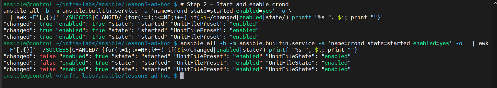

<h1>Lesson 3 – Ad Hoc Commands (Deep Notes)</h1>

<p><b>Goal:</b> Build, validate, and document ad hoc Ansible commands that prove collection usage, FQCN resolution, and idempotent task behavior across managed nodes.</p>

<h3>Control node</h3>
<ul>
  <li><b>Host:</b> <code>control</code> (all Ansible commands run here)</li>
</ul>

<h3>Managed nodes</h3>
<ul>
  <li><b>Hosts:</b> <code>ansible1</code>, <code>ansible2</code>, <code>ansible3</code> – reachable via SSH as user <b>ansible</b> (key-based auth)</li>
</ul>

<h2>What I built / validated</h2>
<ul>
  <li><b>Collections in use:</b> <code>ansible.posix</code>, <code>community.general</code>, <code>community.mysql</code></li>
  <li><b>FQCN usage verified:</b> <code>community.general.timezone</code> (good replacement to show real collection usage)</li>
  <li><b>Idempotent resources on each host:</b>
    <ul>
      <li>Directories: <code>/opt/lesson3</code>, <code>/opt/lesson3/logs</code></li>
      <li>Managed file: <code>/opt/lesson3/info.txt</code></li>
      <li>User: <code>lesson3</code></li>
      <li>Service: <code>crond</code> <i>(started + enabled)</i></li>
    </ul>
  </li>
</ul>

<p align="center">
  <!-- Screenshot: repo overview -->
  
</p>

<hr/>

<h2>Collections: Install & Search Path</h2>

<p><b>Preferred:</b> Using a project-local <code>requirements.yml</code> and local collections path keeps both the Ansible CLI and <code>ansible-navigator</code> aligned.</p>

<p align="center">
  
</p>

<p>
The <code>requirements.yml</code> file defines which Ansible collections my project depends on.<br>
For example:
<ul>
  <li><code>ansible.posix</code> – Core Linux system modules</li>
  <li><code>community.general</code> – Broad community-supported modules</li>
  <li><code>community.mysql</code> – MySQL and MariaDB management</li>
</ul>

Maintaining dependencies in this single YAML file lets anyone who clones my repo reproduce the same environment with one command:
</p>

<pre><code>ansible-galaxy collection install -r requirements.yml -p collections</code></pre>

<p align="center">
  <!-- Screenshot: repo overview -->
  
</p>

<h3>Command Breakdown</h3>
<ul>
  <li><code>ansible-galaxy</code> → Ansible’s package manager for roles and collections.</li>
  <li><code>collection install</code> → Installs all collections listed in the file.</li>
  <li><code>-r requirements.yml</code> → Reads the collection list from this YAML file.</li>
  <li><code>-p collections</code> → Installs them locally into a <code>collections/</code> folder, keeping dependencies isolated per project.</li>
</ul>

<h3>Summary</h3>
<p>
This command installs every collection defined in <code>requirements.yml</code>.<br>
<b>Why I ran it:</b> To ensure all required modules are present and available locally for consistent playbook execution.<br>
<b>Result:</b> A self-contained, portable environment that can be cloned and executed anywhere with identical behavior.
</p>
<p><b>Set the collection path in ansible.cfg if needed:</b></p>

``` bash
collections_path = ./collections:~/.ansible/collections:/usr/share/ansible/collections
```

<p align="center">
  <!-- Optional screenshot: galaxy install -->
  
</p>

<hr/>

<h2>1) Prove FQCN resolution with a real community module</h2>

<pre><code>ansible all -b -m community.general.timezone -a 'name=EST' --check -o
</code></pre>

<ul>
  <li><b>Why:</b> Confirms that <b>community.general</b> collections are installed and discoverable by Ansible. This test uses <code>--check</code> to verify <i>FQCN</i> (Fully Qualified Collection Name) resolution without changing system state.</li>

  <li><b>What it does:</b> Runs a dry-run ad hoc command on <b>all managed nodes</b>, testing if the <code>community.general.timezone</code> module can set <code>EST</code> timezone. Each host returning <code>CHANGED</code> proves the module was found and would modify the timezone if applied for real.</li>

  <li><b>Options used:</b>
    <ul>
      <li><code>-b</code> → Run with elevated privileges (become/sudo).</li>
      <li><code>-m</code> → Specify which module to use (<code>community.general.timezone</code>).</li>
      <li><code>-a</code> → Provide arguments to the module (<code>name=EST</code>).</li>
      <li><code>--check</code> → Run in dry-run mode (no real changes).</li>
      <li><code>-o</code> → Display output in a single line per host (cleaner for screenshots/logs).</li>
    </ul>
  </li>

  <li><b>Acceptance:</b> Each node displays <code>CHANGED</code> in check mode, confirming successful FQCN resolution.</li>
</ul>

<p align="center">
  <!-- Screenshot: timezone check proof -->
  
</p>

<hr/>


<h2>2) Create directories idempotently</h2>

```
# First run (should change)
ansible all -b -m ansible.builtin.file -a 'path=/opt/lesson3a state=directory mode=0755 owner=root group=root' -o
ansible all -b -m ansible.builtin.file -a 'path=/opt/lesson3a/logs state=directory mode=0755 owner=root group=root' -o
```
```
# Re-run (should be ok / no change)
ansible all -b -m ansible.builtin.file -a 'path=/opt/lesson3a state=directory mode=0755 owner=root group=root' -o
ansible all -b -m ansible.builtin.file -a 'path=/opt/lesson3a/logs state=directory mode=0755 owner=root group=root' -o
```
```
# Verify
ansible all -m ansible.builtin.stat -a 'path=/opt/lesson3a' -o
ansible all -m ansible.builtin.stat -a 'path=/opt/lesson3a/logs' -o
```

<p align="center">
  <!-- Screenshot: idempotent directory proof -->
  
</p>
<ul>
  <li><b>Why:</b> I ran this command a second time to demonstrate <i>idempotency</i> — the concept that Ansible only applies changes when something is different.  
  The directories were created on the first run, so the second run should detect no changes and simply report <code>ok</code>.</li>

  <li><b>What it does:</b> Creates two directories (<code>/opt/lesson3a</code> and <code>/opt/lesson3a/logs</code>) with the correct permissions and ownership, 
  then verifies they already exist and match the expected state.</li>

  <li><b>Command breakdown:</b>
    <ul>
      <li><code>-b</code> → Run with sudo privileges (become root).</li>
      <li><code>-m ansible.builtin.file</code> → Uses Ansible’s built-in <b>file module</b>, which manages files, directories, and symlinks on the target system.</li>
      <li><code>-a</code> → Passes arguments: 
        <code>path</code> (location), 
        <code>state=directory</code> (ensures it’s a directory), 
        <code>mode=0755</code> (permissions), 
        <code>owner/group=root</code> (ownership).</li>
      <li><code>-o</code> → Shows one-line output per host for easier reading.</li>
    </ul>
  </li>

  <li><b>Acceptance:</b>
    <ul>
      <li>First run → <code>CHANGED</code> (directories created)</li>
      <li>Second run → <code>ok</code> (no changes — idempotent behavior proven)</li>
      <li><code>stat</code> confirms <code>isdir:true</code>, mode <code>0755</code>, owned by <code>root</code>.</li>
    </ul>
  </li>
</ul>

<h2>3) Manage a file & verify content via hash</h2>

```
# Step 1 — Enforce exact file content + permissions
ansible all -b -m ansible.builtin.copy -a 'dest=/opt/lesson3/info_v2.txt content="Lesson3 FQCN + idempotency (hash demo)" owner=root group=root mode=0644' -o
```
```
# Verify file integrity via SHA256 hash
ansible all -m ansible.builtin.command -a 'sha256sum /opt/lesson3/info_v2.txt' -o
```
```
# View file content on each host
ansible all -m ansible.builtin.command -a 'cat /opt/lesson3/info_v2.txt' -o
```
```
# Step 2 — Re-run to prove idempotency (no changes expected)
ansible all -b -m ansible.builtin.copy -a 'dest=/opt/lesson3/info_v2.txt content="Lesson3 FQCN + idempotency (hash demo)" owner=root group=root mode=0644' -o
```
```
# Verify hash remains unchanged (confirming idempotency)
ansible all -m ansible.builtin.command -a 'sha256sum /opt/lesson3/info_v2.txt' -o
```

<p align="center">
  <!-- Screenshot: copy + sha256 verification -->
  
</p>

<ul>
  <li><b>Why:</b> Demonstrates <i>idempotency</i> with the <code>copy</code> module — showing that identical content and permissions produce no changes when re-run. Also validates file consistency via SHA256 hash.</li>

  <li><b>What it does:</b>
    <ul>
      <li>Creates <code>/opt/lesson3/info_v2.txt</code> with defined content, permissions, and ownership.</li>
      <li>Computes SHA256 checksum across all hosts to verify identical content.</li>
      <li>Re-runs to confirm no changes — proving idempotent behavior.</li>
    </ul>
  </li>

  <li><b>Command breakdown:</b>
    <ul>
      <li><code>-b</code> → Runs with sudo privileges (become root).</li>
      <li><code>-m ansible.builtin.copy</code> → Uses Ansible’s <b>copy module</b> to create or enforce file content and permissions.</li>
      <li><code>-a</code> → Passes module arguments (<code>dest</code>, <code>content</code>, <code>owner/group</code>, <code>mode</code>).</li>
      <li><code>ansible.builtin.command</code> → Runs verification commands (<code>sha256sum</code> and <code>cat</code>) across managed nodes.</li>
      <li><code>-o</code> → Displays compact one-line output per host (clean and exam-friendly).</li>
    </ul>
  </li>

  <li><b>Acceptance:</b>
    <ul>
      <li>First run → <code>CHANGED</code> (file created and hashes identical across all nodes).</li>
      <li>Second run → <code>ok</code> (no change — idempotent behavior confirmed).</li>
      <li><code>sha256sum</code> identical on all hosts; <code>cat</code> output matches expected content.</li>
    </ul>
  </li>
</ul>

<hr/>

<h2>4) Create user <code>lesson3b</code> idempotently</h2>

```
# Step 1 — Create new user 'lesson3b' with a home directory
ansible all -b -m ansible.builtin.user -a 'name=lesson3b state=present shell=/bin/bash create_home=yes' -o
```

```
# Step 2 — Re-run to prove idempotency (no change expected)
ansible all -b -m ansible.builtin.user -a 'name=lesson3b state=present shell=/bin/bash create_home=yes' -o
```
  
```
# Step 3 — Verify user and home directory
ansible all -m ansible.builtin.getent -a 'database=passwd key=lesson3b' -o
ansible all -m ansible.builtin.stat -a 'path=/home/lesson3b' -o
```

<p align="center">
  <!-- Screenshot: user creation + idempotent proof -->
  
</p>

<ul>
  <li><b>Why:</b> Demonstrates <i>idempotency</i> using the <code>user</code> module — ensuring Ansible only creates the user if missing, and reports <code>ok</code> on subsequent runs when the desired state already exists.</li>

  <li><b>What it does:</b>
    <ul>
      <li>Creates a user named <code>lesson3b</code> with the Bash shell and a home directory at <code>/home/lesson3b</code>.</li>
      <li>Re-runs to confirm no additional changes occur (idempotent proof).</li>
      <li>Verifies the user exists using <code>getent</code> and confirms the home directory with <code>stat</code>.</li>
    </ul>
  </li>

  <li><b>Command breakdown:</b>
    <ul>
      <li><code>-b</code> → Run with sudo privileges (become root).</li>
      <li><code>-m ansible.builtin.user</code> → Uses Ansible’s built-in <b>user module</b> to manage local accounts, shells, home directories, and states (<i>present</i>, <i>absent</i>).</li>
      <li><code>-a</code> → Passes module arguments (<code>name</code>, <code>state</code>, <code>shell</code>, <code>create_home</code>).</li>
      <li><code>ansible.builtin.getent</code> → Queries the system user database to confirm user creation.</li>
      <li><code>ansible.builtin.stat</code> → Confirms the existence and ownership of the user’s home directory.</li>
      <li><code>-o</code> → Displays compact one-line output per host for easy readability.</li>
    </ul>
  </li>

  <li><b>Acceptance:</b>
    <ul>
      <li>First run → <code>CHANGED</code> (user created).</li>
      <li>Second run → <code>ok</code> (no change — idempotent behavior confirmed).</li>
      <li><code>getent</code> confirms user <code>lesson3b</code> exists on all nodes; <code>stat</code> confirms <code>/home/lesson3b</code> directory presence.</li>
    </ul>
  </li>
</ul>

<p align="center">
  <!-- Screenshot: user creation + idempotent proof -->
  
</p>

<hr/>

<h2>5) Ensure service <code>crond</code> is started &amp; enabled (idempotent proof)</h2>

```
# Step 1 — Start and enable crond
ansible all -b -m ansible.builtin.service -a 'name=crond state=started enabled=yes' -o \
  | awk -F'[,{}]' '/SUCCESS|CHANGED/ {for(i=1;i<=NF;i++) if($i~/changed|enabled|state/) printf "%s ", $i; print ""}'
```

```
# Step 2 — Re-run to prove idempotency (no change expected)
ansible all -b -m ansible.builtin.service -a 'name=crond state=started enabled=yes' -o \
  | awk -F'[,{}]' '/SUCCESS|CHANGED/ {for(i=1;i<=NF;i++) if($i~/changed|enabled|state/) printf "%s ", $i; print ""}'
```

<p align="center">
  
</p>

<ul>
  <li><b>What the command does:</b>  
    This command ensures the <code>crond</code> daemon is both <b>running</b> and <b>enabled</b> to start on boot across all managed nodes.  
    The use of <code>awk</code> filters and reformats JSON output from Ansible so that only essential fields — 
    <code>changed</code>, <code>enabled</code>, and <code>state</code> — are displayed.  
    Re-running the same command demonstrates <b>idempotency</b>: once the target state is achieved, no further change is made.
  </li>


  
  
  <li><b>Why:</b> Using <code>ansible.builtin.service</code> ensures precise service control. 
    Combined with <code>awk</code>, we extract only key fields (<i>changed</i>, <i>enabled</i>, <i>state</i>) for clean verification output.
  </li>
  
  
  <li><b>Command Breakdown:</b>
    <ul>
      <li><code>-b</code> → Run with privilege escalation (become root).</li>
      <li><code>-m ansible.builtin.service</code> → Uses the service module to manage systemd units.</li>
      <li><code>-a 'name=crond state=started enabled=yes'</code> → Ensures the <code>crond</code> daemon is both active and enabled at boot.</li>
      <li><code>-o</code> → Outputs results in a single-line format (cleaner JSON per host).</li>
      <li><code>awk -F'[,{}]'</code> → Defines comma/braces as field delimiters.</li>
      <li><code>/SUCCESS|CHANGED/</code> → Filters only result lines showing service task results.</li>
      <li><code>$i~/changed|enabled|state/</code> → Extracts the key fields we want from each host’s JSON output.</li>
      <li><code>printf "%s ", $i</code> → Prints each key/value pair inline on one line per host for readability.</li>
      <li><code>print ""</code> → Moves to the next line, giving you one summary line per host.</li>
    </ul>
  </li>
  <li><b>Acceptance Criteria:</b> 
    <ul>
      <li>First run shows <code>changed=true</code>.</li>
      <li>Second run shows <code>changed=false</code>.</li>
      <li>All managed nodes display <code>enabled=true</code> and <code>state=started</code>.</li>
    </ul>
  </li>
</ul>


<h2>6) Module schema quick reference</h2>


# View schema (argument specs) for commonly used modules
```
ansible-doc -s ansible.builtin.file      | head -n 25
```

```  
ansible-doc -s ansible.builtin.copy      | head -n 25
```

```
ansible-doc -s ansible.builtin.user      | head -n 25
```

```
ansible-doc -s ansible.builtin.service   | head -n 25
```

```
ansible-doc -s community.general.timezone | head -n 25
```

<ul>
  <li><b>Module Summaries:</b>
    <ul>
      <li><code>ansible.builtin.file</code> — Manages files, directories, and symlinks; controls ownership, permissions, and state (absent/present).</li>
      <li><code>ansible.builtin.copy</code> — Copies files or text content to remote systems; supports <b>content=</b> or <b>src=</b> for file enforcement, idempotent and byte-accurate.</li>
      <li><code>ansible.builtin.user</code> — Creates, modifies, or removes user accounts; supports home creation, shell assignment, password management.</li>
      <li><code>ansible.builtin.service</code> — Manages systemd services (start, stop, restart, enable/disable); ensures service state consistency across hosts.</li>
      <li><code>community.general.timezone</code> — Adjusts system time zone using data from the <b>tzdata</b> database; part of the <b>community.general</b> collection.</li>
    </ul>
  </li>

  <li><b>What the command does:</b>  
    Each <code>ansible-doc -s</code> command displays the <b>schema summary</b> of a given module — showing parameters, defaults, and accepted options.  
    The <code>head -n 25</code> filter trims output for quick readability in documentation or live study sessions.
  </li>

  
  <li><b>Why:</b>  
    Using <code>ansible-doc -s</code> provides a rapid way to recall argument names and syntax without loading full documentation.  
    Ideal for <b>exam prep</b> and <b>lab reference</b>
  </li>

  
  <li><b>Command Breakdown:</b>
    <ul>
      <li><code>-s</code> → Shows only the short “schema” summary (arguments and defaults).</li>
      <li><code>head -n 25</code> → Limits output to 25 lines for concise review.</li>
      <li><code>ansible.builtin.*</code> → Refers to core modules shipped with Ansible.</li>
      <li><code>community.general.*</code> → Denotes modules from external collections.</li>
    </ul>
  </li>


<h2>Idempotency: Exam Habits</h2>

<p>
  <b>Definition:</b> Idempotency means running the same play or ad-hoc command multiple times
  produces the <b>same final state</b> without additional changes.  
  The second run should always return <code>ok</code>, not <code>changed</code>.
</p>

<ul>

  <!-- 1️⃣ -->
  <li style="margin-bottom: 2em;">
    <b>1️⃣ Use purpose-built modules — not generic ones.</b><br><br>
    Always prefer targeted modules like <code>file</code>, <code>user</code>, <code>service</code>, or <code>copy</code>
    over <code>command</code> or <code>shell</code> to ensure predictable state changes.
    <ul style="margin-left: 1.5em; line-height: 1.8em;">
      <li><code>file</code> → Manages file permissions, ownership, symlinks.</li>
      <li><code>user</code> → Creates or deletes accounts safely.</li>
      <li><code>service</code> → Ensures a service is started/enabled or stopped/disabled.</li>
      <li><code>copy</code> → Deploys files; avoids re-copying if hashes match.</li>
      <li><code>command/shell</code> → Non-idempotent; runs every time regardless of state.</li>
    </ul>
  </li>

  
  
  
  
  <li style="margin-top: 2.5em; margin-bottom: 2.5em;">
  <b>2️⃣ Prove idempotency.</b><br><br>
  Run the same task or ad-hoc twice to confirm consistent system behavior.<br><br>

  <ul style="margin-left: 1.5em; line-height: 1.8em;">
    <li><b>First run:</b> Should show <code>changed</code> — system modified as expected.</li>
    <li><b>Second run:</b> Should show <code>ok</code> — no further changes needed.</li>
    <li><b>Goal:</b> Both runs confirm true idempotency (desired final state reached).</li>
  </ul>
</li>

  
  
  
  
  <li style="margin-bottom: 2em;">
  <b>3️⃣ Verify final state using read-only commands.</b><br><br>
  Validate without changing anything:
  <ul style="margin-left: 1.5em; line-height: 1.8em;">
    <li><code>stat /path/to/file</code> → Confirms file ownership, permissions, existence.</li>
    <li><code>getent passwd username</code> → Verifies user creation.</li>
    <li><code>systemctl is-enabled</code> / <code>is-active</code> → Confirms service status.</li>
    <li><code>sha256sum file</code> → Confirms file integrity for copied files.</li>
  </ul>


  


🧠 **Flags Cheat Sheet (Lesson 3 — Ad-Hoc Command Mastery + Idempotency Proofing)**  

| Flag | Deep-Dive Breakdown |
|------|---------------------|
| `-m <module>` | **Purpose:** Defines the core *action logic* — which Ansible module executes on each host.<br><br>**Exam Relevance:** You are graded on using **FQCN (Fully Qualified Collection Name)**. For example:<br>• `ansible.builtin.file` → Manage filesystem objects (permissions, ownership, symlinks).<br>• `ansible.builtin.user` → Create/delete accounts idempotently.<br>• `ansible.builtin.copy` → Deploy files with checksum comparison; no unnecessary rewrites.<br>• `ansible.builtin.service` → Control systemd units (start/stop/enable/disable).<br><br>**Behavior:** The module defines *state management*, not execution flow. Each ensures predictable outcomes and enables **idempotency** (second run returns OK).<br><br>**Verification:** `ansible all -m ansible.builtin.<module> --check` → Preview. Then run normally and confirm second run = `ok`. |
| `-a <args>` | **Purpose:** Pass module parameters; this is your “configuration payload.”<br><br>**Example:**<br>`-a 'path=/opt/lesson3/info.txt content="Lesson 3 – Managed by Ansible" owner=root group=root mode=0644'`<br><br>**Behavior:** Everything after `-a` is parsed by the target module.<br>• Key=value pairs set desired resource state.<br>• Strings with spaces or special chars must be quoted.<br><br>**Common Pattern:** `state=present` / `absent` / `directory` / `started` / `enabled=yes`.<br>**Exam Trap:** Forgetting quotes → YAML parse errors; mixing `:` and `=` syntax → invalid arguments.<br><br>**Verification:** Re-run same command twice → First `CHANGED`, second `OK`. Confirm with `stat`, `getent`, `sha256sum`, or `systemctl is-active`. |
| `-b` | **Purpose:** Escalate privileges → runs commands with `become=true` (sudo).<br><br>**When Needed:** Any operation that alters `/etc`, `/usr`, `/var`, services, or system accounts.<br><br>**Example:**<br>`ansible all -b -m ansible.builtin.service -a 'name=crond state=started enabled=yes'`<br><br>**Verification:** `ansible all -b -a 'whoami'` → Expect `root` returned from each managed host.<br>**Security Note:** Controlled escalation only; avoid using `-b` for read-only commands to reduce attack surface.<br><br>**Exam Insight:** Without `-b`, service and copy modules may silently fail with “Permission denied.” |
| `-o` | **Purpose:** Compact “one-line-per-host” output mode for clean state summaries.<br><br>**Why:** During exam or triage, you need rapid visual proof without full JSON noise.<br>**Example:**<br>`ansible all -b -m ansible.builtin.service -a 'name=crond state=started enabled=yes' -o`<br><br>**Behavior:** Suppresses multi-line structured output; merges host result into one readable record.<br>**Analysis Trick:** Pipe to `awk` or `grep` for batch verification across dozens of nodes:<br>`ansible all -m ansible.builtin.service -a 'name=crond state=started enabled=yes' -o | awk '/SUCCESS|CHANGED/'`<br><br>**Verification:** Look for `CHANGED` on first run, `SUCCESS => changed=false` on second — that’s idempotency proof. |
| `--check` | **Purpose:** Executes a **dry-run (plan mode)** — predicts what *would* change without modifying targets.<br><br>**Behavior:** Ansible evaluates modules and renders a “proposed change set.”<br>Shows `changed=true` for simulated changes but applies nothing.<br><br>**Example:**<br>`ansible all -b -m ansible.builtin.copy -a 'src=/tmp/testfile dest=/etc/testfile' --check -o`<br><br>**Use Case:** Validate destructive operations, test role logic, or ensure syntax safety during exams.<br><br>**Verification:** Compare `--check` output vs. real execution; identical host list = logic verified.<br><br>**Pro-Tip:** Combine with `-vv` for verbose detail of what Ansible *would* do; pair with `-o` for concise readability. |

---

### 🧩 Advanced Integration Tips

| Concept | Application |
|----------|--------------|
| **FQCN discipline** | Always use `ansible.builtin.<module>` → Prevents ambiguity in restricted or exam environments. |
| **Two-run validation** | Run every stateful module twice; expect `CHANGED → OK`. This is your **idempotency proof cycle**. |
| **Hash verification** | After `copy`, confirm integrity with `ansible all -m ansible.builtin.command -a 'sha256sum /opt/lesson3/info.txt' -o`. |
| **Service persistence check** | `ansible all -m ansible.builtin.command -a 'systemctl is-enabled crond' -o` → Ensures persistence through reboot. |
| **User presence test** | `ansible all -m ansible.builtin.command -a 'getent passwd student' -o` → Confirms account creation. |
| **File ownership validation** | `ansible all -m ansible.builtin.stat -a 'path=/opt/lesson3/info.txt' -o` → Returns owner, mode, mtime. |

---

<i>End of Lesson 3 notes</i>
